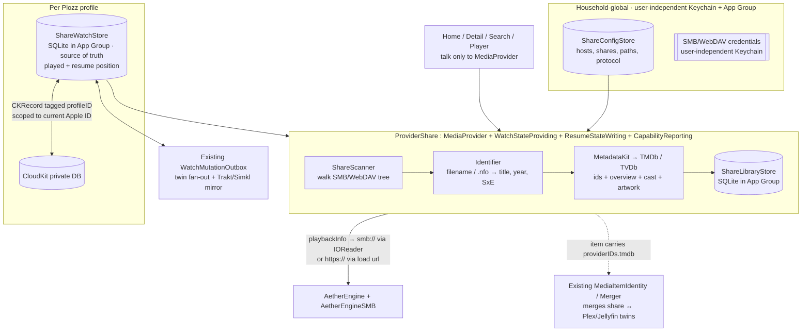

# Local Media Share Support — Design Proposal

**Status:** Proposed — design record for adding a **local media share** (SMB / WebDAV)
as a third, second-class backend alongside Plex and Jellyfin.
**Scope:** Let a user point Plozz at a "dumb" file share (NAS over SMB2/3, or a
WebDAV/HTTP file server) and get a browsable, playable library with artwork,
metadata, resume, and watched state — without a Plex/Jellyfin server in the path.
**Owning constraint:** Everything above the provider layer talks to the
`MediaProvider` protocol in `CoreModels`, never to a backend directly. A media
share must preserve that seam and stay **invisible to users who don't add one**.
Plex and Jellyfin remain the first-class, "king" experiences; a share is a
deliberately smaller, opt-in citizen.

---

## 1. The core problem

A real media server (Plex/Jellyfin) hands us, for free, the things the whole app
is built around: a typed library tree, rich metadata + artwork, a search index,
**server-side transcoding**, and a durable **watch-state store** that syncs across
clients. A plain share provides none of that — only a directory of bytes.

So "add a media share" is really: **replace the two services a server gives us —
a metadata/library index and a place to store watch state — with on-device
equivalents**, while reusing everything else Plozz already does above the provider
seam (Home fan-out, cross-source identity/merge, playback routing, the watch
outbox).

This is exactly the model Infuse uses for SMB/DLNA shares: on-device TMDb/TheTVDB
scraping for metadata, and an app-owned library DB for watched/resume state synced
across devices via iCloud. No server involved.

---

## 2. How a share fits the existing `MediaProvider` abstraction

Adding a backend is *designed* to be cheap: one `MediaProvider` conformer, one
`ProviderKind` case, one `registry.register(...)` line in
`AppState.makeDefaultRegistry()`. That stays true here. What's different from
Plex/Jellyfin is that the conformer is backed by **local stores** instead of a
network API.

`ProviderShare` conforms to:
- `MediaProvider` — library browsing, item detail, search, `playbackInfo`,
  `imageURL`. Backed by `ShareLibraryStore` (below), not a server.
- `WatchStateProviding` + `ResumeStateWriting` — but writes land in a **local**
  `ShareWatchStore`, never a network call.
- `CapabilityReporting` — advertises `.video` only.

Everything the protocol already makes optional — trailers, remote-subtitle
search/download, server skip-intro/credits segments, trickplay scrub previews —
is simply **not** implemented and inherits the protocol's safe empty/no-op
defaults. The `MediaProvider` contract was effectively pre-designed for a partial
provider like this.

---

## 3. Metadata & identification

- **Reuse `MetadataKit`.** It already resolves a TMDb id from a title/year
  `MetadataQuery` and returns artwork. We add a "fetch full metadata" path
  (overview, cast, production year, genres, season/episode mapping, episode
  stills) on top of the existing id resolution.
- **The genuinely hard, new part is the `Identifier`** — parsing scene-named
  files into a query: `Movie Name (2021).mkv`,
  `Show/Season 01/Show - S01E02 - Title.mkv`, etc., plus `.nfo` sidecars when
  present. This is where Infuse has invested years; v1 handles the common
  conventions and provides a manual **"Fix Match"** affordance for misses.
- **Payoff for merge:** once scraped, each item carries `providerIDs["tmdb"]`
  (and IMDb/TVDb where resolvable), so it flows through the **existing**
  `MediaItemIdentity`/`MediaItemMerger` engine unchanged and **merges with the
  user's Plex/Jellyfin copies** of the same title with no new merge logic.

---

## 4. Watch state — the part that reuses the most

Today watch state is **100% server-backed**: `WatchStateProviding` /
`ResumeStateWriting` write *through* a provider to a server, and
`WatchMutationOutbox` / `WatchStateReconciler` fan one play out to every server
plus external trackers (Trakt/Simkl/AniList/MAL). There is **no local watch
store** yet.

Design:
1. Add `ShareWatchStore` — a **local SQLite DB in the App Group** holding played
   flags + resume positions. This is the **source of truth**.
2. `ProviderShare`'s `WatchStateProviding`/`ResumeStateWriting` writes land in
   `ShareWatchStore` instead of a network call. A local write never fails, so a
   share is a trivially reliable outbox target.
3. `ProviderShare.continueWatching()` / `latest()` are **synthesized** from
   `ShareWatchStore` (+ scanner mtime for "recently added"), since there's no
   server to compute them.
4. Because the outbox addresses targets as "accountID → provider that conforms to
   the watch protocols," the share becomes **just another fan-out target**. When a
   share title merges with a Plex/Jellyfin twin (same TMDb id), watching it on
   either side converges both — and Trakt/Simkl mirroring comes along — using
   machinery that already ships. *(Build-time check: `WatchMutationApplier` in
   `AppShell` must resolve a share account the same way it resolves Plex/Jellyfin;
   likely a small addition.)*

### 4.1 CloudKit sync + the profile/Apple-ID scoping tension

Chosen approach: **CloudKit + a local SQLite mirror (App Group) as the source of
truth**, CloudKit syncs the mirror.

The subtlety is scoping. Plozz uses the `com.apple.developer.user-management`
entitlement (`runs-as-current-user-with-user-independent-keychain`):
- **Per Apple TV system user (≈ per Apple ID):** `UserDefaults` + default Keychain
  are partitioned. All current per-profile settings live here.
- **Household-global (shared across system users):** account sign-ins **and** the
  Plozz profile set, kept in the user-independent Keychain.

CloudKit's private DB is inherently **per-Apple-ID** and cannot span two Apple IDs
(a hard platform rule — Infuse has the same limit). So we split the two concerns:

| Concern | Scope | Storage |
| --- | --- | --- |
| **Share config + credentials** | **Household-global** | user-independent Keychain (creds) + App-Group `ShareConfigStore` |
| **Watch state** (played / resume) | **Per Plozz profile** | per-profile `ShareWatchStore` (App Group) + CloudKit |

CloudKit records are written to the **current Apple ID's private DB** and tagged
with a **`profileID`** field so multiple profiles under one Apple ID stay separate.

Resulting behavior:

| Situation | Outcome |
| --- | --- |
| One Apple ID, multiple profiles | One iCloud DB; histories separated by `profileID`; each profile syncs across that Apple ID's devices |
| Separate Apple IDs (separate system users / devices) | Separate iCloud DBs → separate share history per Apple ID. Share **config** stays household-global on a given box, so the NAS isn't re-added |
| Everyone shares one Apple ID, different profiles | Shared DB, separate histories via `profileID` |

**Known edge (v1 tolerates, documents):** a profile object is household-global
(one `profileID`) but sync is per-Apple-ID. If the *same* profile is used under
*two different* Apple IDs on one Apple TV, that `profileID` accumulates two
divergent histories in two iCloud accounts, so its Continue Watching appears to
change when the box's active Apple ID changes. In practice a person uses one
Apple ID; this only bites households that share profiles across Apple IDs on one
device, and "your own history per Apple ID" is defensible/privacy-positive. A
later "bind this profile's sync to a home Apple ID" toggle could remove it, but
that's out of scope for v1.

---

## 5. Playback

- Add the upstream **`AetherEngineSMB`** product (AMSMB2-backed) to the
  `EnginePlozzigen` target. Give `PlozzigenVideoEngine` a
  `load(source: .custom(SMBIOReader(...)))` path alongside the existing
  `load(url:)` path.
- **WebDAV / HTTP shares need nothing new** — the core engine reads range-readable
  HTTP(S) via its custom AVIO + `URLSession`, so those play through `load(url:)`.
- tvOS requires `NSLocalNetworkUsageDescription` + the local-network entitlement
  to reach a LAN share.
- **Only the Plozzigen/AetherEngine engine can consume a custom `IOReader`**; the
  AVPlayer-native path cannot. On a custom reader the native path re-muxes to
  cleartext fMP4 on the loopback cache (fine for at-rest content).
- **No transcoding.** Playback is limited to what the device + AetherEngine can
  decode on-device (which is wide — MKV, HEVC/AV1, DoVi, Atmos, DTS/TrueHD
  bridged). There is **no server-side downscale fallback**, so a very high-bitrate
  4K file over a slow remote link may buffer with no graceful degradation.
- SMB support is **read-only, NTLMv2 / guest auth (no Kerberos)**.

---

## 6. UI / onboarding (second-class citizen)

The merged add-account flow (`AppShell/AddAccountView`) is already a clean
`ProviderKind?` chooser with two `ProviderBrandMark` cards (Jellyfin, Plex). The
share slots in as:
- A **small secondary button below the two cards** ("Add a local media share"),
  matching the intended "Plex or Jellyfin, or (small share button)" hierarchy.
- A new `ProviderKind.mediaShare` case (+ `displayName`, + a `ProviderBrandMark`
  symbol) and a `case .mediaShare` branch in `AddAccountView` that pushes a new
  `AddShareView` (protocol SMB/WebDAV, host, share, path, credentials).
- One new `registry.register(.mediaShare) { ... }` line.

---

## 7. What's reused vs. new vs. lost

| | |
| --- | --- |
| **Reused free** | Home rows, Search, detail pages, playback (incl. SMB via `AetherEngineSMB`), **cross-source merge with Plex/Jellyfin**, and — pending the applier tweak — **cross-server watch sync via the existing outbox** + Trakt/Simkl mirror |
| **New code** | `ProviderShare`, `ShareScanner`, `Identifier`, `ShareLibraryStore`, `ShareWatchStore` (+ CloudKit mirror), `ShareConfigStore`, `AddShareView`, a `.mediaShare` kind, a MetadataKit "full metadata" path |
| **Lost vs. a server** | On-the-fly transcoding (device-decode only, no downscale fallback), server skip-intro/credits, trickplay scrub previews, "official" server metadata, other-users' watched state |

---

## 8. Phasing

1. **Playback spike** — add `AetherEngineSMB` + a `load(source:)` path + tvOS
   entitlements; prove SMB bytes → DoVi/Atmos pipeline end-to-end on the Apple TV.
2. **Provider + library** — `ProviderShare`, scanner, identifier, MetadataKit
   full-fetch, `ShareLibraryStore`; browse and play a real share (no watch state).
3. **Watch state (local)** — `ShareWatchStore` + outbox target wiring + twin
   fan-out.
4. **CloudKit sync** — mirror `ShareWatchStore`, `profileID` partitioning.
5. **Polish** — Fix Match UI, onboarding, edge cases.
